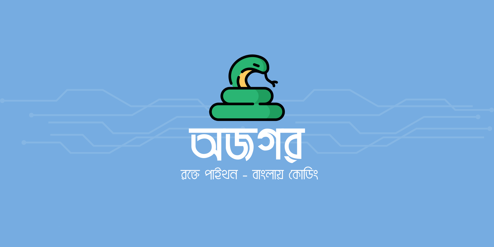

# স্বাগতম 🐍

<figure><figcaption></figcaption></figure>

স্বাগতম **অজগর**-এ, বাংলা ভাষায় তৈরি একটি মজার ও স্যাটায়ারধর্মী প্রোগ্রামিং ভাষা! 🎉

আপনি যদি কোডিং করতে করতে হাসতে চান, প্রোগ্রামিং শেখার নতুন মজা খুঁজে পেতে চান, বা নিজের ভাষায় কোডিং করার স্বাদ নিতে চান – তাহলে **অজগর** আপনার জন্য!

#### **অজগর কী?**

**অজগর** হলো একটি সহজ ও ব্যতিক্রমী প্রোগ্রামিং ভাষা, যা বাংলা ভাষায় লিখতে ও বুঝতে সহজ। এটি মজার সিনট্যাক্স, সরল লজিক এবং ব্যবহার-বান্ধব কাঠামো নিয়ে তৈরি।

#### **কেন অজগর ব্যবহার করবেন?**

✅ **বাংলা সিনট্যাক্স** – বাংলা ভাষায় কোড লেখার আনন্দ!\
✅ **সহজ ও সরল** – নতুনদের জন্য পারফেক্ট!\
✅ **ব্যতিক্রমী ও মজাদার** – প্রোগ্রামিং শেখার নতুন মজা!\
✅ **ওপেন-সোর্স** – আপনার অবদান রাখতে পারেন!

#### **কীভাবে শুরু করবেন?**

1️⃣ **অজগর ইনস্টল করুন**\
2️⃣ **প্রথম প্রোগ্রাম লিখুন:**

```og
দেখাও "হ্যালো, অজগর!"
```

3️⃣ **শেখা শুরু করুন!**

🚀 **আর দেরি কেন? চলুন, কোডিং শুরু করি!** 🚀

